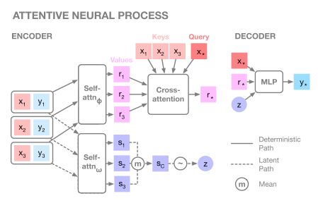

# Using attentive neural processes for forecasting power usage

This project uses [Attentive Neural Process](https://arxiv.org/abs/1901.05761) (ANP) on kaggle smart meter data.

This repository also includes a pytorch implementation that has been tweaked to be more flexible and stable. It may be usefull if you are looking for a ANP model in pytorch, and seems more stable than others available now (as of 2019-11-01).

## Usage

- clone this repository
- see requirements.txt for requirements and version
- Start and run the notebook [smartmeters.ipynb](https://github.com/wassname/attentive-neural-processes/blob/master/smartmeters.ipynb)

## Data
- Some data is included, you can get more from https://www.kaggle.com/jeanmidev/smart-meters-in-london/version/11
- Inputs are: 
  - Weather
  - Time features: time of day, day of week, month of year, etc
  - Bank holidays
  - Position in sequence: days since start of window
- Target is: mean power usage on block 0

## Example outputs

Here the black dots are input data, the dotted line is the true data. The blue line is the prediction, and the blue shadow is the uncertainty to one standard deviation.

I chose a a difficult example below, it's a window in the test set that deviates from the previous pattern. Given 3 days inputs, it must predict the next day, and the next day has higher power usage than previously. The trained model manages to predict it based on the inputs.

Compare this to a quick LSTM baseline below, which didn't predict this divergance from the pattern. (Bear in mind that I didn't tweak this model as much). The uncertainty and prediction are also less smooth and the log probability is lower.

## Code

This is based on the code listed in the next section, with some changes. The most notable ones add stability, others are to make sure it can handle predicting into the future:

Changes for a predictive use case:
- target points are always in the future, context is in the past
- context and and targets are still sampled randomly during training

Changes for stability:
- in eval mode, take mean of latent space, and mean of output isntead of sampling
- use log_variance where possible (there is a flag to try without this, and it seems to help)
  - and add a minimum bound to std (in log domain) to avoid mode collapse (one path using log_var one not)
- use log_prob loss (not mseloss or BCELoss)
- use pytorch attention (which has dropout) instead of custom attention
- use_deterministic option
- use batchnorm and dropout on channel dimensions
- check and skip nonfinite values because for extreme inputs we can still get nan's

## See also:

A list of projects I used as reference, is modified to make this one:

- Original code in tensorflow from hyunjik11 (author of the original paper) : https://github.com/deepmind/neural-processes/blob/master/attentive_neural_process.ipynb
- First pytorch implementation by soobinseo: https://github.com/soobinseo/Attentive-Neural-Process/blob/master/network.py
- Second pytorch implementation KurochkinAlexey (has some bugs currently) https://github.com/KurochkinAlexey/Attentive-neural-processes/blob/master/anp_1d_regression.ipynb
- If you want to try vanilla neural processes: https://github.com/EmilienDupont/neural-processes/blob/master/example-1d.ipynb

